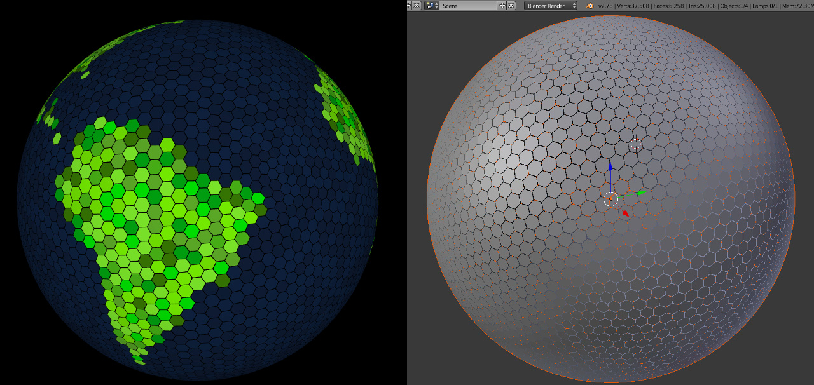

# GridWorld

An interactive 3D hexasphere world simulation built with Three.js, featuring real-time population management, village systems, and a custom calendar simulation.



## Features

- 🌍 **Interactive 3D Hexasphere** - Procedurally generated planet with clickable tiles
- 👥 **Population Simulation** - Real-time population growth, births, deaths, and aging
- 🏘️ **Village System** - Autonomous villages with residents and food management
- 📅 **Calendar System** - Custom game calendar with day/month/year progression
- 🔄 **Real-time Sync** - WebSocket-based live updates across all connected clients
- 💾 **Dual Storage** - Redis for fast in-memory state, PostgreSQL for persistence
- 🚀 **Modern Stack** - TypeScript, Express, Socket.IO, Three.js, Webpack

## Prerequisites

- **Node.js** >= 18.0.0
- **Redis** - For real-time game state
- **PostgreSQL** - For persistent storage
- **npm** or **yarn**

## Quick Start

### 1. Clone and Install

```bash
git clone https://github.com/your-repo/gridworld.git
cd gridworld
npm install
```

### 2. Configure Environment

Create a `.env` file in the project root:

```env
# PostgreSQL Database Connection
DB_USER=your_postgres_user
DB_HOST=localhost
DB_NAME=gridworld
DB_PASSWORD=your_postgres_password
DB_PORT=5432

# World generation seed (change this to get a different world)
WORLD_SEED=12345

# Hexasphere Generation Parameters
# RADIUS: Size of the sphere (default: 50)
# SUBDIVISIONS: Detail level - tiles = 10n² + 2 (12 = 1,442 tiles)
# TILE_WIDTH_RATIO: Gap between tiles (1 = touching)
HEXASPHERE_RADIUS=50
HEXASPHERE_SUBDIVISIONS=12
HEXASPHERE_TILE_WIDTH_RATIO=1

# Custom Calendar Configuration
# 8 days per month, 12 months per year = 96 days/year
CALENDAR_DAYS_PER_MONTH=8
CALENDAR_MONTHS_PER_YEAR=12
CALENDAR_START_YEAR=4000
CALENDAR_START_MONTH=1
CALENDAR_START_DAY=1
CALENDAR_AUTO_START=true
CALENDAR_DEFAULT_SPEED=1_day
CALENDAR_TICK_INTERVAL_MS=1000
```

### 3. Initialize Database

```bash
# Create the PostgreSQL database first
createdb gridworld

# Run migrations
npm run db:init
```

### 4. Start Development Server

```bash
npm run full-auto
```

This starts:
- **Webpack Dev Server** on `http://localhost:8080` (client with hot reload)
- **Express API Server** on `http://localhost:3000` (backend with auto-restart)

Open http://localhost:8080 in your browser.

## Available Scripts

### Development

| Command | Description |
|---------|-------------|
| `npm run full-auto` | Start both client and server in watch mode (recommended) |
| `npm run dev` | Start Webpack dev server only |
| `npm run server:watch` | Start backend server with nodemon |
| `npm run server:dev` | Start backend server without watch |

### Building

| Command | Description |
|---------|-------------|
| `npm run build` | Build both client and server for production |
| `npm run build:client` | Build client only |
| `npm run build:server` | Build server only |
| `npm run clean` | Remove dist folder |

### Production

| Command | Description |
|---------|-------------|
| `npm run prod` | Build and start production server |
| `npm run server` | Start production server (requires build first) |

### Testing

| Command | Description |
|---------|-------------|
| `npm test` | Run all tests |
| `npm run test:unit` | Run unit tests only |
| `npm run test:integration` | Run integration tests only |
| `npm run test:coverage` | Run tests with coverage report |
| `npm run test:watch` | Run tests in watch mode |

### Database

| Command | Description |
|---------|-------------|
| `npm run db:init` | Initialize database schema |
| `npm run db:reset` | Reset and reinitialize database |

### Simulation

| Command | Description |
|---------|-------------|
| `npm run simulate` | Run 100-year simulation |
| `npm run simulate:10y` | Run 10-year simulation |
| `npm run simulate:50y` | Run 50-year simulation |

## Project Structure

```
GridWorld/
├── src/                    # Client-side code
│   ├── index.ts           # Client entry point
│   ├── core/              # Core modules
│   │   ├── hexasphere/    # Hexasphere generation
│   │   ├── scene/         # Three.js scene management
│   │   └── input/         # Input handling
│   ├── components/        # UI components
│   ├── managers/          # State managers
│   ├── services/          # API & Socket services
│   └── utils/             # Utility functions
│
├── server/                 # Server-side code
│   ├── index.ts           # Server entry point
│   ├── config/            # Configuration files
│   │   ├── database.ts    # PostgreSQL config
│   │   ├── redis.ts       # Redis config
│   │   ├── server.ts      # Server settings
│   │   └── gameBalance.ts # Game constants
│   ├── routes/            # API routes
│   │   ├── api.ts         # Main API router
│   │   ├── tiles.ts       # Tile endpoints
│   │   ├── population.ts  # Population endpoints
│   │   ├── villages.ts    # Village endpoints
│   │   └── calendar.ts    # Calendar endpoints
│   ├── services/          # Business logic
│   │   ├── storage.ts     # Redis storage layer
│   │   ├── worldRestart/  # World generation
│   │   └── ...
│   ├── models/            # Data models
│   ├── repositories/      # Data access layer
│   └── migrations/        # Database migrations
│
├── scripts/               # Utility scripts
├── css/                   # Stylesheets
├── dist/                  # Build output (generated)
└── types/                 # TypeScript type definitions
```

## API Endpoints

### Configuration
- `GET /api/config` - Get server configuration

### Tiles
- `GET /api/tiles` - Get all tiles with geometry
- `GET /api/tiles/state` - Get compact tile state (optimized)
- `GET /api/tiles/:id` - Get detailed tile data

### Population
- `GET /api/population` - Get population statistics
- `GET /api/population/tile/:id` - Get tile population
- `POST /api/population` - Update population

### Villages
- `GET /api/villages` - List all villages
- `GET /api/villages/:id` - Get village details
- `GET /api/villages/:id/residents` - Get village residents

### Calendar
- `GET /api/calendar/state` - Get current calendar state
- `POST /api/calendar/start` - Start calendar progression
- `POST /api/calendar/stop` - Stop calendar progression
- `POST /api/calendar/tick` - Advance one day manually

### World Management
- `POST /api/worldrestart` - Regenerate world with new seed
- `POST /api/save` - Save Redis state to PostgreSQL
- `POST /api/load` - Load state from PostgreSQL to Redis

## Environment Variables

### Server Configuration

| Variable | Default | Description |
|----------|---------|-------------|
| `PORT` | `3000` | Server port |
| `NODE_ENV` | `development` | Environment mode |
| `VERBOSE_LOGS` | `false` | Enable detailed logging |
| `AUTO_SAVE_ENABLED` | `false` | Auto-save to PostgreSQL |

### Database (PostgreSQL)

| Variable | Default | Description |
|----------|---------|-------------|
| `DB_HOST` | `localhost` | PostgreSQL host |
| `DB_PORT` | `5432` | PostgreSQL port |
| `DB_NAME` | `gridworld` | Database name |
| `DB_USER` | `postgres` | Database user |
| `DB_PASSWORD` | `password` | Database password |
| `DB_POOL_MAX` | `20` | Max pool connections |

### Redis

| Variable | Default | Description |
|----------|---------|-------------|
| `REDIS_HOST` | `localhost` | Redis host |
| `REDIS_PORT` | `6379` | Redis port |

### Hexasphere

| Variable | Default | Description |
|----------|---------|-------------|
| `HEXASPHERE_RADIUS` | `30` | Sphere radius |
| `HEXASPHERE_SUBDIVISIONS` | `3` | Subdivision level (affects tile count) |
| `HEXASPHERE_TILE_WIDTH_RATIO` | `1` | Tile width ratio |

**Subdivision levels:**
- `2` = 162 tiles
- `3` = 642 tiles
- `4` = 1442 tiles (default)
- `5` = 2562 tiles

## Controls

### Mouse
- **Left Click** - Select tile
- **Left Drag** - Rotate globe
- **Scroll** - Zoom in/out

### Keyboard
- **Space** - Toggle auto-rotation
- **R** - Reset camera position
- **T** - Toggle tile labels
- **+/-** - Adjust rotation speed

## WebSocket Events

The application uses Socket.IO for real-time updates:

### Client → Server
- `subscribe:tile` - Subscribe to tile updates
- `unsubscribe:tile` - Unsubscribe from tile

### Server → Client
- `population:update` - Population changed
- `calendar:tick` - Day advanced
- `village:update` - Village data changed
- `tile:update` - Tile state changed

## Testing

```bash
# Run all tests
npm test

# Run unit tests only
npm run test:unit

# Run integration tests only
npm run test:integration

# Run with coverage
npm run test:coverage

# Watch mode
npm run test:watch
```

**Tips:**
- Keep tests small and focused: test one unit of behavior at a time
- Prefer the `MemoryAdapter` for storage-related unit tests
- Use `describe.only` / `test.only` locally to focus on a single test

## Troubleshooting

### Redis Connection Failed
```
Error: Redis connection to localhost:6379 failed
```
Ensure Redis is running:
```bash
# Windows (if using WSL or Docker)
redis-server

# Or check if running
redis-cli ping
```

### PostgreSQL Connection Failed
```
Error: connect ECONNREFUSED 127.0.0.1:5432
```
1. Ensure PostgreSQL is running
2. Verify credentials in `.env`
3. Create database: `createdb gridworld`
4. Run migrations: `npm run db:init`

### Port Already in Use
```
Error: listen EADDRINUSE: address already in use :::8080
```
Kill existing Node processes:
```bash
# Windows
taskkill /F /IM node.exe

# Linux/Mac
pkill -f node
```

### World Not Initialized
```
Error: World not initialized - No tiles found
```
The world generates automatically on first server start. If Redis was flushed, restart the server to regenerate.

## Tech Stack

- **Frontend**: Three.js, TypeScript, Webpack
- **Backend**: Express, Socket.IO, TypeScript
- **Database**: PostgreSQL (persistence), Redis (real-time state)
- **Testing**: Jest, ts-jest
- **Build**: Webpack, Babel, TypeScript

## License

The MIT License (MIT) Copyright (c) 2014-2017 Robert Scanlon

Permission is hereby granted, free of charge, to any person obtaining a copy of this software and associated documentation files (the "Software"), to deal in the Software without restriction, including without limitation the rights to use, copy, modify, merge, publish, distribute, sublicense, and/or sell copies of the Software, and to permit persons to whom the Software is furnished to do so, subject to the following conditions:

The above copyright notice and this permission notice shall be included in all copies or substantial portions of the Software.

THE SOFTWARE IS PROVIDED "AS IS", WITHOUT WARRANTY OF ANY KIND, EXPRESS OR IMPLIED, INCLUDING BUT NOT LIMITED TO THE WARRANTIES OF MERCHANTABILITY, FITNESS FOR A PARTICULAR PURPOSE AND NONINFRINGEMENT. IN NO EVENT SHALL THE AUTHORS OR COPYRIGHT HOLDERS BE LIABLE FOR ANY CLAIM, DAMAGES OR OTHER LIABILITY, WHETHER IN AN ACTION OF CONTRACT, TORT OR OTHERWISE, ARISING FROM, OUT OF OR IN CONNECTION WITH THE SOFTWARE OR THE USE OR OTHER DEALINGS IN THE SOFTWARE.

## Credits

Based on [hexasphere.js](https://github.com/arscan/hexasphere.js) by Rob Scanlon.
